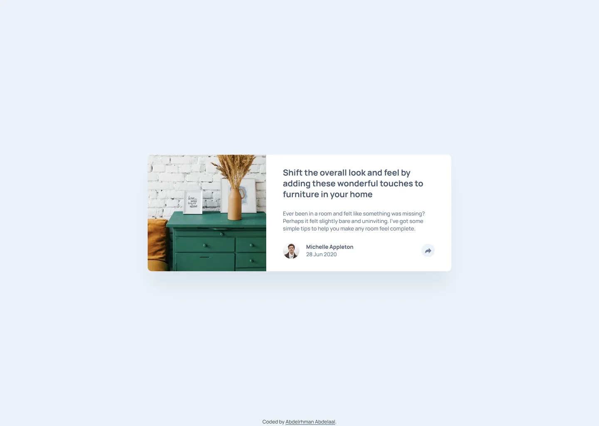

# Frontend Mentor - Article preview component solution

This is a solution to the [Article preview component challenge on Frontend Mentor](https://www.frontendmentor.io/challenges/article-preview-component-dYBN_pYFT). Frontend Mentor challenges help you improve your coding skills by building realistic projects.

## Table of contents

- [Overview](#overview)
  - [Screenshot](#screenshot)
  - [Links](#links)
- [My process](#my-process)
  - [Built with](#built-with)
  - [Design deviations](#design-deviations)
- [Author](#author)

## Overview

### Screenshot

### Links

- Solution URL: [GitHub](https://github.com/MrBlackvanta/article-preview-component)
- Live Site URL: [Cloudflare](https://article-preview-component.abdelrhman-ahmed8881.workers.dev)
- Mirror: [Netlify](https://vanta-article-preview-component.netlify.app)

## My process

### Built with

- [Next.js 16](https://nextjs.org/) (App Router, React Compiler, Turbopack)
- [React 19](https://react.dev/)
- [TypeScript](https://www.typescriptlang.org/)
- [Tailwind CSS v4](https://tailwindcss.com/)
- Semantic HTML5 markup
- Mobile-first workflow

### Design deviations

Colours come from the `.fig` rather than `style-guide.md`, whose HSL values round a
point off on two of the four: `hsl(214, 17%, 51%)` resolves to `#6D7F97` where the file
paints `#6E8098`, and `hsl(212, 23%, 69%)` to `#9EAFC2` against the file's `#9DAEC2`.

Every text pairing was measured against its actual backdrop. Three failed WCAG AA, and
each moved by the smallest amount that clears the threshold with hue and saturation held:

| Role | Design | Shipped | Contrast before → after |
| ---- | ------ | ------- | ----------------------- |
| Body copy | `#6E8098` | `#667890` | 4.04 → **4.51** |
| Date | `#9DAEC2` | `#5E7998` | 2.27 → **4.50** |
| SHARE label | `#9DAEC2` | `#BECAD7` | 3.33 → **4.53** |

The date and the SHARE label are a single colour in the design (`#9DAEC2`) sitting on
opposite backdrops — white and `#48556A`. Passing requires the date to darken and the
label to lighten, so one design token necessarily becomes two.

Other notes:

- **The share button's disc and the card itself are below 3:1** against what sits behind
  them (both 1.13). Neither is a boundary 1.4.11 applies to: the button is identified by
  the glyph inside it (`#6E8098` on `#ECF2F8`, 3.58), and the card is a surface rather
  than a control, with the drop shadow doing its edge work.
- **The heading's letter-spacing is stored in different units per frame** — `0.25` reads
  as pixels in the mobile and tablet frames and as a percentage in the desktop one. Both
  are sub-pixel at 20px, so no tracking is applied to anything but the SHARE label, whose
  25% is a real 0.25em.
- **The attribution is not in the design.** It uses `#48556A` on the page background
  (6.69) rather than the body grey, which only reaches 4.00 there.

## Author

- Frontend Mentor - [@MrBlackvanta](https://www.frontendmentor.io/profile/MrBlackvanta)
- LinkedIn - [Abdelrhman Abdelaal](https://www.linkedin.com/in/abdelrhman-vanta/)
- UpWork - [Abdelrhman Abdelaal](https://upwork.com/freelancers/~01f0a9479696b61f49)
